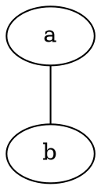
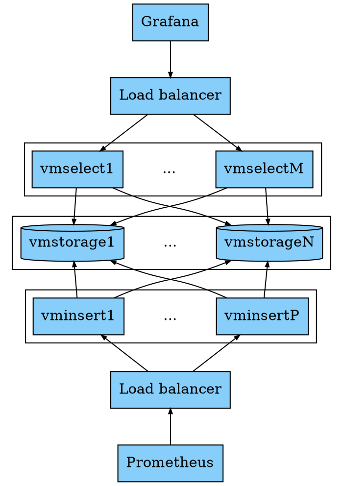

[Graphviz](https://www.graphviz.org/)是一款著名的图形可视化软件。我初次听闻该软件还是使用go pprof时，第一感觉挺酷的。

> Graphviz is open source graph visualization software. Graph visualization is a way of representing structural information as diagrams of abstract graphs and networks. It has important applications in networking, bioinformatics, software engineering, database and web design, machine learning, and in visual interfaces for other technical domains.

Graphviz体现了"**Graph As Code**"的思想（这个思想是我现编的，不知道存不存在）。将图形用代码表示至少有如下好处：
* 方便分发和迁移，因为它不局限于某一种格式（如svg，jpeg，pdf等），只要是同一段代码，表示的图形一定相同
* 版本控制
* 能够编写程序生成图形，比如上述的pprof
* ...

但是，用代码表示图形也意味着有一定学习成本。毕竟一般人还是更加习惯使用“**所见即所得**”的画图软件，通过点击、拖拽等一系列操作来制作和编辑图形的。但这点学习量对于作为程序员的我们来说自然不在话下！


下面对Graphviz做简要的介绍。它使用一种叫做**DOT**的语言来描述图形，这应该可视为DSL。用DOT语言编写的程序一般以.dot作为后缀名保存为。

在MacOS上使用`brew install graphviz`安装。验证安装成功：
```shell
$ dot -V
dot - graphviz version 3.0.0 (20220226.1711)
```

在使用Graphviz前需要先理解一些核心概念/关键词。
* graph：表示无向图
* digraph：表示有向图，即 directed graph
* subgraph：子图，常用来表示一个集群（cluster）
* node：节点
* edge：边，分为有方向和无方向两种，分别用`->`和`--`表示


命令行工具 dot 的基本用法是：`dot -Tsvg input.dot > output.svg`，意思是将input.dot中描述的图形用svg格式输出。
常用的命令行参数有：
* -T，设置输出的格式，支持svg，pdf，gif，jpeg，bmp等
* -G，设置graph的属性
* -N，设置node的属性；
* -E，设置edge的属性；
* -K，设置layout engine，支持以下几种layout engine，每种都有同名的命令行工具可供直接使用：
  * dot：对于有方向的edge是默认的引擎，它的布局算法致力于edge方向一致，尽量避免edge的交错，减少edge的长度
  * neato：当图里的节点数在100以内并且对图的其他信息一无所知时默认使用该引擎
  * twopi：雷达图形式的layout
  * circo：环形layout
  * fdp：和neato类似，但是算法实现上有区别
  * osage：draw clustered graphs
  * patchwork：draws clustered graphs using a squarified treemap layout
  * sfdp：Multiscale version of fdp for the layout of large graphs.

Graphviz支持设置图形、节点、边的[属性](https://graphviz.org/doc/info/attrs.html)，包括形状、颜色、箭头样式、文本标签等。这些属性基本可以满足各种图形定制化需求了。

在实践方面有两个工具可以提高用Graphviz绘图的生产力：
* [在线可视化编辑器](http://magjac.com/graphviz-visual-editor/)
* vscode graphviz插件，可以边画图边预览

而且markdown的code block也支持显示Graphviz图形，比如：


下面做一个小练习。我试图绘制VictoriaMetrics cluster的架构图，其原图长这样：

一通摸索后，绘图如下：

注意：上图是markdown直接渲染graphviz出来的，为方便查看，将源代码再贴一遍：
```
digraph VictoriaMetrics {
    node [shape=box fillcolor=lightskyblue style=filled]
    edge [arrowsize=0.5]

    LB1 [label="Load balancer"]
    LB2 [label="Load balancer"]

    subgraph cluster_vmselect {
        remincross = false
        {
            rank = same;
            vmselect1 -> vmselect2 -> vmselectM [style=invis]
        }
        vmselect2[shape=plaintext label="..." style=""]
    }
    subgraph cluster_vmstorage {
        remincross = false
        {
            rank = same
            vmstorage1 -> vmstorage2 -> vmstorageN [style=invis]
        }
        vmstorage1 [shape=cylinder]
        vmstorage2 [shape=plaintext label="..." style=""]
        vmstorageN [shape=cylinder]
    }
    subgraph cluster_vminsert {
        remincross = false
        {
            rank = same
            vminsert1 -> vminsert2 -> vminsertP [style=invis]
        }
        vminsert2[shape=plaintext label="..." style=""]
    }
    
    Grafana -> LB1
    LB1 -> {vmselect1, vmselectM}
    {vmselect1, vmselectM} -> {vmstorage1, vmstorageN} 
    {vmstorage1, vmstorageN} -> {vminsert1, vminsertP} [dir=back]
    {vminsert1, vminsertP} -> LB2 [dir=back]
    LB2 -> Prometheus [dir=back]
}
```

这里面有几个点值得一提。
* 使用“虚拟”节点来表示图形中的"..."，如`vmstorage2 [shape=plaintext label="..." style=""]`
* 使用匿名子图（anonymous subgraph）表示多个节点间的交叉连接关系，使得代码更整洁，如`{vmselect1, vmselectM} -> {vmstorage1, vmstorageN}`
* 使用嵌套的子图和不可见的边来控制一个集群里的节点的位置关系：
    ```
    {
        rank = same
        vminsert1 -> vminsert2 -> vminsertP [style=invis]
    }
    ```

Graphviz的功能远比上述例子能展示出来的部分强得多，想想pprof那么复杂的图，或者再看看[官方画廊里](https://www.graphviz.org/gallery/)的形形色色的图形。更多功能和奇技淫巧需要在实践中再探索了。

Graphviz有一个Python的库：https://github.com/xflr6/graphviz。 我试用了一下，感觉还不错。它提供的API简洁易用，比较Pythonic。为了熟悉这个库，又用它把上面的图形绘制了一遍，代码如下：
```python
import graphviz

g = graphviz.Digraph("VictoriaMetrics", format="svg")

# 全局属性
g.node_attr["shape"] = "box"
g.node_attr["fillcolor"] = "lightskyblue"
g.node_attr["style"] = "filled"
g.edge_attr["arrowsize"] = "0.5"

g.node("Grafana")
g.node("LB1", label="Load balancer")
g.node("LB2", label="Load balancer")
g.node("Prometheus")

with g.subgraph(name="cluster_vmselect") as vmselect_cluster:
    vmselect_cluster.attr(remincross="false")
    vmselect_cluster.node("vmselect1")
    vmselect_cluster.node("vmselect2", label="...", style="", shape="plaintext")
    vmselect_cluster.node("vmselectM")
    with vmselect_cluster.subgraph() as x:
        x.attr(rank="same")
        x.edge("vmselect1", "vmselect2", style="invis")
        x.edge("vmselect2", "vmselectM", style="invis")

with g.subgraph(name="cluster_vmstorage") as vmstorage_cluster:
    vmstorage_cluster.attr(remincross="false")
    vmstorage_cluster.node("vmstorage1", shape="cylinder")
    vmstorage_cluster.node("vmstorage2", label="...", style="", shape="plaintext")
    vmstorage_cluster.node("vmstorageN", shape="cylinder")
    with vmstorage_cluster.subgraph() as x:
        x.attr(rank="same")
        x.edge("vmstorage1", "vmstorage2", style="invis")
        x.edge("vmstorage2", "vmstorageN", style="invis")

with g.subgraph(name="cluster_vminsert") as vminsert_cluster:
    vminsert_cluster.attr(remincross="false")
    vminsert_cluster.node("vminsert1")
    vminsert_cluster.node("vminsert2", label="...", style="", shape="plaintext")
    vminsert_cluster.node("vminsertP")
    with vminsert_cluster.subgraph() as x:
        x.attr(rank="same")
        x.edge("vminsert1", "vminsert2", style="invis")
        x.edge("vminsert2", "vminsertP", style="invis")

g.edge("Grafana", "LB1")
g.edge("LB1", "vmselect1")
g.edge("LB1", "vmselectM")
g.edge("vmselect1", "vmstorage1")
g.edge("vmselect1", "vmstorageN")
g.edge("vmselectM", "vmstorage1")
g.edge("vmselectM", "vmstorageN")

g.edge("LB2", "Prometheus", dir="back")
g.edge("vminsert1", "LB2", dir="back")
g.edge("vminsertP", "LB2", dir="back")
g.edge("vmstorage1", "vminsert1", dir="back")
g.edge("vmstorageN", "vminsert1", dir="back")
g.edge("vmstorage1", "vminsertP", dir="back")
g.edge("vmstorageN", "vminsertP", dir="back")

print(g.source)

g.view()
```


后续我想“研究”一个基于Graphviz的绘制系统架构原型图的Python库[mingrammer/diagrams](https://github.com/mingrammer/diagrams)。这个库更酷了，看看这个小例子吧：
```python
from diagrams import Diagram
from diagrams.onprem.analytics import Flink
from diagrams.onprem.queue import Kafka
from diagrams.onprem.database import ClickHouse
from diagrams.elastic.elasticsearch import Elasticsearch, Kibana


with Diagram("Log Platform", show=True):
    Kafka("queue") >> Flink("consumer") >> [ClickHouse("storage1"), Elasticsearch("storage2")] >> Kibana("dashboard")
```
效果图：


注意到代码里使用了`>>`来表示边，这是怎么做到的呢？ 猜测该是和自定义“魔法方法”有关，等我再看看源码吧。

另一件要做的事情是找一个Go语言的Graphviz库试试，说不定能在工作中用到呢！


参考资料：
1. [Graphviz Documentation](https://www.graphviz.org/documentation/)
2. [xflr6/graphviz](https://github.com/xflr6/graphviz)
